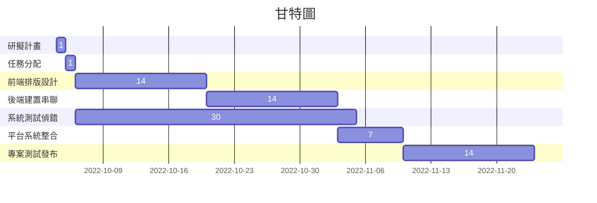

# group08
***

## 組員名單及任務
|職位 |學號|姓名|任務內容|
|-----|--------|--------|--------|
|組長|C109118222|林佑任|討論主題、系統測試|
|組員|C109118202|張忠雄|討論主題、前端架設|
|組員|C109118230|吳紀緯|討論主題、前端架設|
|組員|C109118235|楊昇諭|討論主題、後端架設|
|組員|C109118256|廖俊傑|討論主題、後端架設|
***

## 專題題目
POS系統架設及應用-某某飲料店的點餐機
***

## 專題內容
零售業常見之POS系統基礎架設及實際應用
***

## 甘特圖

***
## PERT圖

